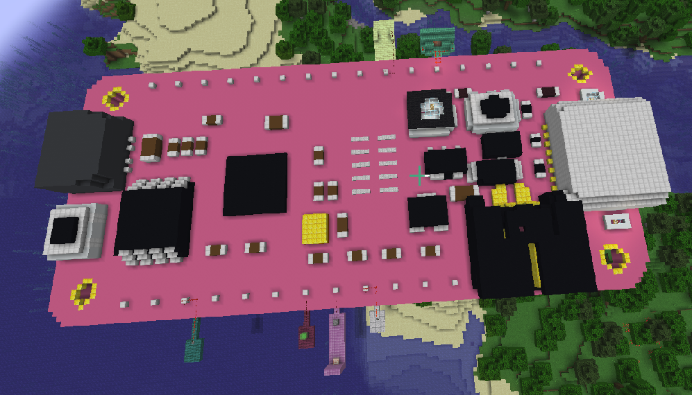
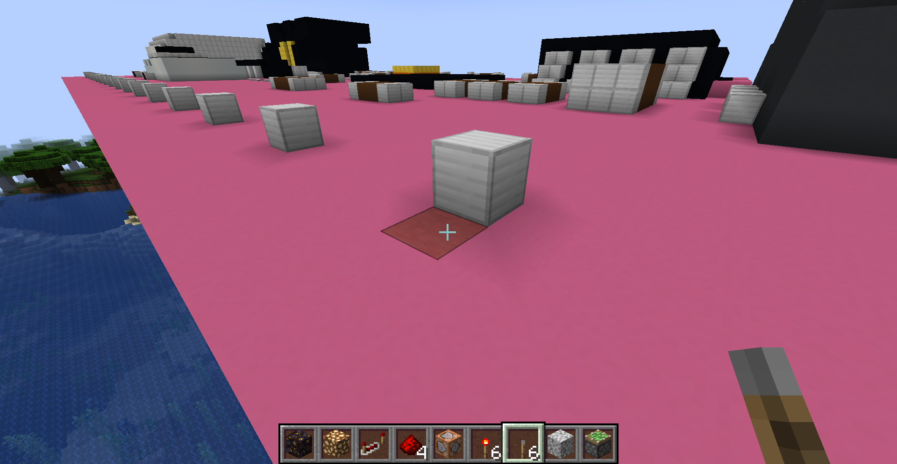

# Introduction Video and How-To Playlists
https://www.youtube.com/watch?v=WTONPr3u-5U&list=PLX7KM5dlGnexgDwWIOirw65qUtp1G0b2P

# Overview
The project consists of three main components. 

- `.schematic` file that can get pasted into a world with the World Edit plugin.
- Spigot server plugin that contains commands for initializing and interacting with the virtaul Feather.
- CircuitPython script that runs on the physical Feather for communicating with the plugin and sharing pin state back and forth between them.

# Setup
If you want to set up your own Feather I will outline the steps you'll need to do in order to get it spawned and running.

High level steps:

- Load the `feather_commander.py` script onto your Feather. [circuitpython_setup.md](circuitpython_setup.md) 
- Install and get running Spigot server [spigot_server_setup.md](spigot_server_setup.md)
- Use `/op [player name]` to make your player a server operator so they can use the required commands.
- Add the WorldEdit and Feather plugins [plugins_setup.md](plugins_setup.md)
- Put the Feather `pink_feather.schemetic` into the world edit schematics folder
- Paste the feather into minecraft with the commands `//schem load pink_feather` and `//paste`
- Find and look directly at the designated starting location block. Directly next to pin D4. It's a darker shade of pink.

- Run /start_feather (Your cursor must be pointed at the starting location when you run this command!)
- set up the pins that you want to use with `/set_pin_read` and `/set_pin_write` commands

# Feather Plugin Commands
